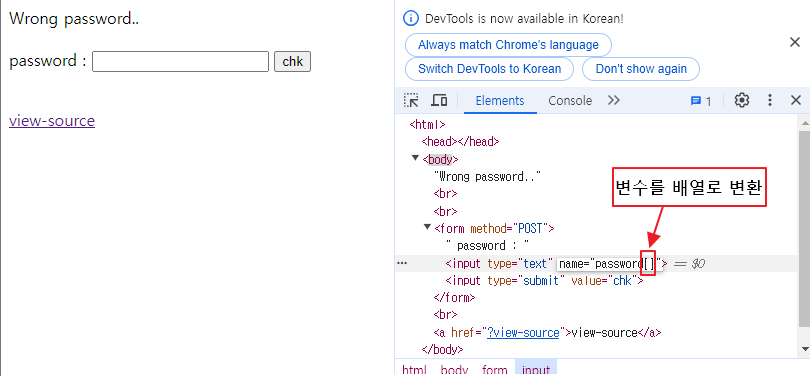

```php
<?php
    require("./lib.php"); // for FLAG

    $password = sha1(md5(rand().rand().rand()).rand());

    if (isset($_GET['view-source'])) {
        show_source(__FILE__);
        exit();
    }else if(isset($_POST['password'])){
        sleep(1); // do not brute force!
        if (strcmp($_POST['password'], $password) == 0) {
            echo "Congratulations! Flag is <b>" . $FLAG ."</b>";
            exit();
        } else {
            echo "Wrong password..";
        }
    }

?>
<br />
<br />
<form method="POST">
    password : <input type="text" name="password" /> <input type="submit" value="chk">
</form>
<br />
<a href="?view-source">view-source</a>
```

### strcmp 리턴값을 조작
낮은 php 버전에서 아래 현상이 발생함
```
strcmp('1234', '1234')은 0을 반환
strcmp(배열, '1234')도 0을 반환
```

따라서, 아래와 같이 배열값을 전달할 경우 로직 우회가 가능함


# 정리
PHP의 낮은 버전(특히 PHP 5.3 이전)에서는 `strcmp()` 함수에 **배열을 인자로 전달**하면 현재와 같이 **경고 없이 `0`을 반환**하는 문제가 있었습니다. 이는 예기치 않은 결과를 초래할 수 있어 보안 취약점이 될 수 있습니다.

### 예시 (낮은 버전의 PHP)

```php
$result = strcmp(['array'], '1234'); 
echo $result; // 낮은 버전에서는 0을 반환
```

이 상황에서는 배열을 문자열과 비교할 수 없음에도 불구하고 `0`을 반환하여 두 값이 같다고 간주하게 됩니다. 이로 인해, 비교 로직에서 보안 취약점이나 버그가 발생할 수 있습니다.

### 해결 방법

최신 PHP에서는 이러한 문제를 **경고 메시지와 함께 `null`을 반환**하도록 수정되었습니다. 그러나 구버전을 사용할 경우 **입력 데이터가 문자열인지 확인**하거나, **최신 버전으로 업그레이드**하는 것이 좋습니다.

### 대안 코드

```php
// 데이터 타입 확인
if (is_string($input1) && is_string($input2)) {
    $result = strcmp($input1, $input2);
} else {
    // 문자열이 아닐 경우 처리
    echo "비교할 수 없는 데이터 타입입니다.";
}
```

이렇게 하면 예상하지 못한 결과를 방지하고 비교 작업의 안전성을 높일 수 있습니다.